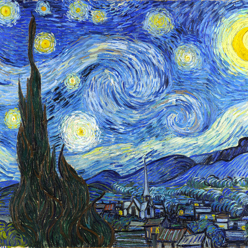

# Neural Style Transfer
## Introduction
This is a Keras implementation of the paper [A Neural Algorithm of Artistic Style](https://arxiv.org/abs/1508.06576) by Leon A. Gatys, Alexander S. Ecker, and Matthias Bethge.
The paper presents an algorithm for combining the content of one image with the style of another image using convolutional neural networks.

## Usage

```
$ python3 style_transfer.py content.jpg style.jpg
```

## Input
<p float="left">
  
  
</p>

## Output
<p align="left">
  
</p>

## Parameters
- Content Weight = 0.025
- Style Weight = 10.0
- Total Variation Weight = 1.0

## References
* https://arxiv.org/abs/1508.06576
* https://github.com/hnarayanan/stylist
